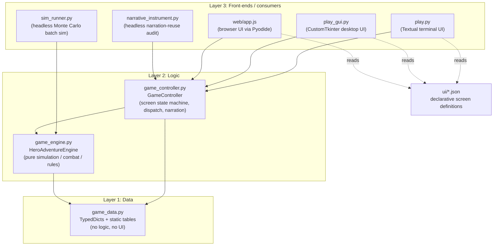
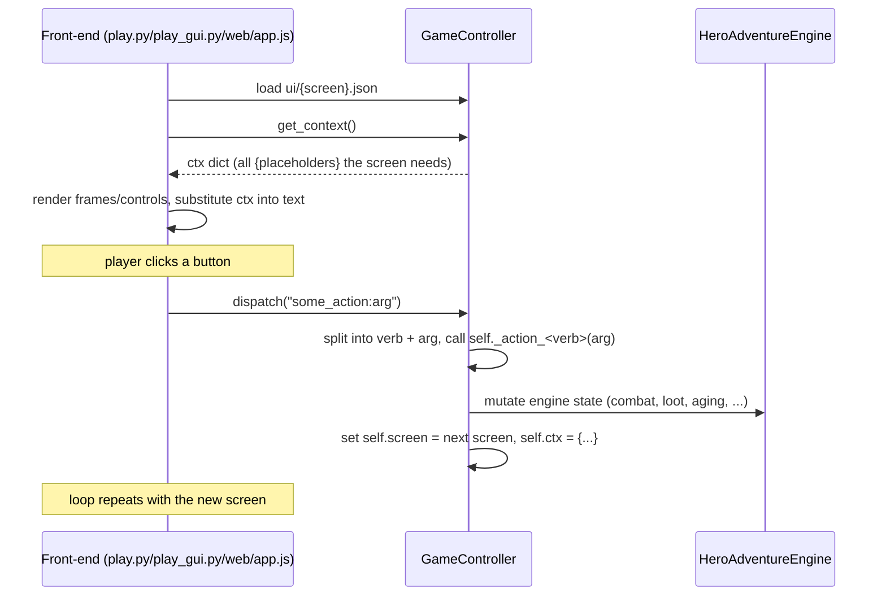

# Hero Adventure - Architecture Guide

Hero Adventure is a text-driven, stat-based adventure/roguelite game. This
document explains how the code is organized, how a single "turn" flows
through the system, and what every module/class/function is for. It's meant
to be read once top-to-bottom, then used as a reference.

The rest of the design (game rules, balance numbers, feature history) lives
in [heroadventure.md](heroadventure.md), [dumb.md](../../dumb.md) and
[smart.md](../../smart.md). This document only covers *code* architecture.

## 1. High-level architecture

The codebase is split into three layers, strictly one-way dependent (each
layer only imports the one below it):

**Why the split:** `HeroAdventureEngine` is the "rules of the world" (combat
math, loot, aging, dungeons) and has no idea a UI exists. `GameController`
is the "UI-agnostic app" - it owns which screen is showing, turns player
actions into engine calls, and assembles the narration/flavor text. None of
the three front-ends (`play.py`, `play_gui.py`, `web/app.js`) contain any
game rules; they are pure renderers of whatever `GameController` says the
current screen and context are.

This module used to be one 2,966-line file, `hero_engine.py`, containing
both the engine and the controller. It was split into `game_engine.py` +
`game_controller.py` for readability; `hero_engine.py` no longer exists in
the codebase or on disk - `game_engine.py`/`game_controller.py` are the sole
source of truth.

## 2. Program flow

### 2.1 The screen state machine

`GameController` has one piece of state that matters most: `self.screen`, a
string like `"journey"`, `"combat"`, `"capital"`, etc. Each screen name maps
1:1 to a JSON file in `ui/` (e.g. `self.screen == "journey"` ->
`ui/journey.json`).

A single interaction cycle looks like this:

- **`GameController.get_context()`** builds one flat dict per render: hero
  stats (if an engine exists), plus whatever `self.ctx` was populated with
  by the last action, plus screen-specific list rows (inventory rows, shop
  rows, combat risk %s, etc. - built by the various `_build_*_rows` /
  `_format_*` helpers).
- **`GameController.dispatch(action)`** is the single entry point for every
  player action. Actions are strings like `"advance_event"` or
  `"trader_buy:2"` (verb, optionally `:arg`). It looks up `_action_<verb>`
  by reflection (`getattr`) and calls it with the arg if present. A special
  `"goto:<screen>"` action bypasses handler lookup and just jumps screens
  directly (used for simple back/cancel buttons).
- Action handlers (`_action_*`) are the only code that mutates `self.screen`
  in response to player input; everything else only reads it.

### 2.2 The JSON UI schema

Every file in `ui/` describes one screen as:
- `frames`: named layout regions (`status`, `scene`, `context`, `actions`),
  each with a `ratio` (relative size) and `overflow` behavior
  (`collapse`/`truncate`/`page`). All three front-ends interpret these the
  same way, just with different widget toolkits (Textual, CustomTkinter, or
  plain HTML/CSS in the browser).
- `controls`: the widgets placed inside a frame - `text`, `progressbar`,
  `list`, `button`, `input`, etc. Any `{name}` inside a control's `value`/
  `label` is substituted from the `get_context()` dict at render time
  (missing keys render literally as `{name}` rather than crashing, via a
  `SafeDict`).
- `button` controls carry an `action` string, which is exactly what gets
  passed to `dispatch()` when clicked.
- `list` controls are populated from a `list_*` key in the context dict
  (e.g. `list_inventory`, `list_trader_buy`) - each row is a dict with
  `text`/`action`/`enabled`, built by a `_build_*_rows` helper in
  `GameController`.

This means **adding a new screen or button never requires touching
`play.py`/`play_gui.py`/`web/app.js`** - only a new/edited `ui/*.json` file
plus the corresponding `_action_*` handler and context keys in
`game_controller.py`.

### 2.3 Two parallel "drivers" of the engine

- **Interactive play** (`play.py`/`play_gui.py`/`web/app.js`) drives
  `GameController`, one player click at a time, forever (until quit).
  `web/app.js` does this from inside a browser tab by running the actual
  `game_engine.py`/`game_controller.py`/`game_data.py` source under Pyodide
  (CPython compiled to WebAssembly) - it is not a reimplementation or a
  build artifact, just the same Python source fetched at runtime.
- **`sim_runner.py`** drives `HeroAdventureEngine` directly (skipping
  `GameController` and all UI/narration entirely) via
  `HeroAdventureEngine.step_next_event()`, a single call that advances the
  simulation by exactly one event and returns a short outcome code. A
  `MonteCarloAgent` wraps this loop with simple heuristics (what to buy,
  which skills to level, fight vs. flee) so thousands of runs can be
  simulated in seconds for balance analysis.
- **`narrative_instrument.py`** drives `GameController` (not the engine
  directly) headlessly, because narration text is only ever generated by
  the controller - it exists purely to catch overused flavor-text lines
  (see `GameController.line_usage_counts`).

## 3. File-by-file guide

| File | Role |
|---|---|
| `game_data.py` | All static data: TypedDict schemas (`Item`, `Monster`, `Dungeon`, `Leg`, ...) and every game-balance table (`CLASSES`, `MONSTERS`, `LEGS`, `HOUSES`, `PENSIONS`, narration templates, etc). No logic, no imports from the other two modules. |
| `game_engine.py` | `HeroAdventureEngine` - the simulation/rules layer. Combat math, inventory/equipment, dungeons, aging/retirement, scoring. Fully UI-agnostic; used by both `GameController` and `sim_runner.py`. |
| `game_controller.py` | `GameController` - the UI-agnostic app layer. Screen state machine, action dispatch, save/load, narration & backstory text assembly, context-dict building for the JSON renderers. |
| `play.py` | Textual (terminal) front-end. Renders whatever `ui/{screen}.json` + `GameController.get_context()` describe; forwards button clicks to `dispatch()`. |
| `play_gui.py` | CustomTkinter (desktop window) front-end; same contract as `play.py`, different widget toolkit. |
| `web/` | Browser front-end (`index.html`/`style.css`/`app.js`): runs the real `game_engine.py`/`game_controller.py`/`game_data.py` inside Pyodide (WASM CPython), fetched unmodified at page-load time - a third renderer of the same `ui/*.json` contract, not a port/rewrite. See `web/README.md` for hosting/local-testing details. The repo-root `index.html` is just a redirect to `web/index.html` for GitHub Pages. |
| `sim_runner.py` | Headless Monte Carlo batch simulator driving `HeroAdventureEngine` directly via `step_next_event()`; writes `sim_logs/sim_events.jsonl` + `sim_summary.json`. Used for balance-tuning, not gameplay. |
| `narrative_instrument.py` | Headless batch driver of `GameController` (not the engine) that plays full games and reports which narration template lines get reused more than a target threshold within one playthrough. |
| `analyze_balance.py` | Post-processes `sim_logs/sim_summary.json` + `sim_events.jsonl` into win/death rates, economy progression, and monster lethality reports. |
| `combat_odds.py` | Standalone analysis: exact win-probability table for a "typical" hero of each class vs. every monster in each leg, using the same math as `HeroAdventureEngine.estimate_fight_risk`. Used to spot "guaranteed win" matchups. |
| `sneak_odds.py` | Same idea as `combat_odds.py` but for the stealth-based actions (sneak/steal/stealth_kill) instead of straight fighting. |
| `leveling_window.py` | Computes, per class/per leg, the min/median/max value a single stat can reach from that leg's level-up choice + obtainable gear - used to sanity-check monster difficulty against realistic player power. |
| `rebalance_monsters.py` | One-off tool that rescales every monster's attack/defense stat to fit inside the `leveling_window.py`-computed window for its leg. |
| `ui/*.json` | One file per screen (28 screens): declarative frame/control layout consumed identically by both front-ends. |
| `saves/` (created at runtime) | One JSON file per named hero save slot, written by `GameController._action_save_game`. |
| `sim_logs/` (created at runtime) | Output of `sim_runner.py` - `sim_events.jsonl` (per-event log) + `sim_summary.json` (aggregates). Gitignored; scratch/analysis output, not part of the shipped game. |

## 4. `game_data.py` reference

Pure data module - a `TypedDict` schema for every structured value the game
passes around, plus every tunable table:

**Schemas:** `Dungeon`, `Leg`, `Monster`, `ItemCategoryEntry`, `QualityTier`,
`RelicDef`, `House`, `Pension`, `Item`, `HonorificTitle`.

**Data tables (grouped by topic):**
- Character setup: `CLASSES`
- World/progression: `LEGS`, `MONSTERS`, `DUNGEON_FIND_CHANCE`,
  `BOSS_BONUS_TIER_BY_LEG`
- Items/loot: `ITEM_CATEGORIES`, `QUALITY_TIERS`, `RELICS`,
  `EQUIPMENT_SLOT_LABELS`, `INVENTORY_ITEM_CAP`, `RELIC_MONSTER_SCALE`
- Retirement/scoring: `HOUSES`, `PENSIONS`, `PENSION_END_AGE_MIN/MAX`,
  `PENSION_BASELINE_YEARS`, `AGE_START`, `FORCED_RETIREMENT_AGE`
- Town recovery/aging: `DAMAGE_PER_TOWN_YEAR`, `TOWN_JOB_OFFER_CHANCE`,
  `TOWN_PROFESSIONS`, `TOWN_PROFESSION_MODIFIERS`, `TOWN_INJURIES`,
  `TOWN_BODY_PARTS`, `PRISON_CHANCE_CAP`, `PRISON_KARMA_SCALE`
- Karma/reputation: `KARMA_STEALTH_KILL_PENALTY`, `KARMA_STEAL_PENALTY`,
  `HONORIFIC_TITLES`, `NEGATIVE_KARMA_TITLES`, `CHARACTER_TITLE_PARTS`
- Backstory/origin story: `HERO_HOMETOWNS`, `HERO_FAMILY_MEMBERS`,
  `HERO_FAMILY_TRAITS`, `HERO_ASPIRATIONS`, `ORIGIN_STORY_CLOSERS`,
  `ORIGIN_STORY_TEMPLATES`
- Narration text pools: `EVENT_NARRATION_TEMPLATES`,
  `REPEAT_ENCOUNTER_TEMPLATES`, `REMINISCENCE_TEMPLATES`,
  `REMINISCENCE_CHANCE`, `REMINISCENCE_ELIGIBLE_EVENTS`,
  `NARRATION_EVENT_SCREENS`, `LEG_VIBES`, `KILL_PHRASES`, `OUTCOME_TEXT`,
  `DEATH_REASONS`, `RETIREMENT_DEATH_REASONS`, `DUNGEON_EXIT_REASONS`
- Combat flavor text: `MAGIC_SPELL_NAME_PARTS`, `MAGIC_SHIELD_NAME_PARTS`,
  `COMBAT_LINE_POOLS`, `RISK_BANDS`

## 5. `game_engine.py` reference - `HeroAdventureEngine`

All state for one playthrough lives on `self` (see `__init__` for the full
attribute list: skills, hp/cash/age, inventory/equipment, journey/dungeon
progress, karma, backstory, and several balance-experiment feature toggles
used only by `sim_runner.py`'s A/B testing).

| Method | Purpose |
|---|---|
| `log_special_moment` / `log` | Record a notable moment (for reminiscence text) / a generic structured event (for `sim_runner.py`'s JSONL log; no-op unless a logger is attached). |
| `get_effective_skills` | Base skills + equipment bonuses - weight-penalty, capped by carry weight; returns (skills, total_weight, max_weight). |
| `generate_random_item` | Rolls a new item: category, quality tier, and (if applicable) skill bonus, scaled by leg number. |
| `auto_equip_best` | Equips the best available item per slot at character creation. |
| `_opposed_roll` / `_opposed_win_probability` | Core dice-vs-dice contested check (sampled / exact-probability versions of the same formula) underlying every combat/stealth/steal roll. |
| `_kill_phrase`, `_combat_line`, `_combat_action_line`, `_combat_round_detail` | Flavor-text assembly for one combat round (varies phrasing, avoids repeats within a fight via `used_lines`). |
| `_magic_spell_name` / `_magic_shield_name` | Random flavor names for magic-class combat text. |
| `_fight_core_stats` | Player's current attack stat + weight-adjusted effective defense for the active class. |
| `_get_monster_stats` | Monster's stats, optionally leg-scaled (see `relic_scaling_enabled`). |
| `pick_throwable_item` | Picks a consumable/throwable item from inventory for the "throw item" combat option, if any. |
| `estimate_fight_risk` / `_risk_band_for_probability` / `estimate_combat_action_risks` | Pre-combat odds preview (win %, risk band, rounds-to-kill/die) shown on the combat screen before the player picks fight/sneak/steal/stealth_kill/throw. |
| `resolve_fight` | The actual combat resolution for whichever action the player picked - runs the round loop, applies karma penalties for steal/stealth_kill, and calls `grant_monster_loot`/`take_damage` as needed. Returns an outcome string or `None`. |
| `take_damage` | Applies damage, triggers death handling (sets `death_reason`) at 0 HP. |
| `grant_monster_loot` / `_roll_loot_item_count` | Rolls cash + item drops after a win (including relic drops on legs 4-5). |
| `get_random_monster` | Picks a random regular (non-boss, non-super) monster for the current leg. |
| `roll_journey_event_type` | Picks what happens on the next journey step (regular fight, dungeon, super monster, magic shrine, wandering trader, nothing). |
| `try_spot_dungeon` / `try_leg_transition` | Per-event dungeon-discovery roll (capped at 2/leg) / end-of-leg transition check (town recovery vs. capital/retirement). |
| `enter_dungeon` / `leave_dungeon` / `get_dungeon_floor_monster` / `advance_dungeon_floor` | Dungeon sub-state machine (5 floors + a boss). |
| `resolve_magic_shrine` | Rolls the magic-shrine event's cash/item reward. |
| `capture_fairy` | Rolls the "wandering fairy" capture-or-flee event, returning the fairy item if captured. |
| `apply_wander_group_advance` | Handles the "join a group of travelers" event that skips several journey steps at once. |
| `trader_buy_multiplier` / `trader_sell_multiplier` / `generate_trader_offer` / `trader_buy` / `trader_sell` | Wandering-trader and town-shop economy (buy/sell price multipliers driven by `speech` skill, stock generation, transaction application). |
| `apply_level_up` | Applies a +5 stat pick at end-of-leg level-up. |
| `advance_to_next_leg` | Resets per-leg counters and moves to the next leg. |
| `sell_all_for_capital` | Liquidates inventory into cash when the hero reaches the capital (game end). |
| `get_pension` / `get_house_options` | Retirement-scoring math: pension from final cash (via `PENSIONS` table + a lazily-rolled retirement age), and the list of purchasable houses with affordability/score. |
| `step_next_event` | The single-call "advance simulation by one event" API used by `sim_runner.py` - internally re-implements the same event-type/dungeon/combat flow as `GameController`, but headlessly (no narration, auto-resolves combat). |
| `get_tactical_choice` | Heuristic fight/sneak/steal/stealth_kill choice for `sim_runner.py`'s `MonteCarloAgent`, based on estimated risk. |
| `calculate_score` | Final score computation at game end (used by `step_next_event`'s capital-arrival path). |

## 6. `game_controller.py` reference - `GameController`

State (see `__init__`): `self.engine: HeroAdventureEngine | None` (`None`
before a game starts / after death+continue), `self.screen`, `self.ctx`
(the last action's screen-specific context additions), plus
save/load/UI-only bookkeeping (`pending_name`, `selected_item_letter`,
`trader_offer`, `levelup_chosen`, etc).

**Note on `self.engine` and `None`:** Several methods are only ever called
while `self.engine` is not `None` (mid-game screens); those use
`assert self.engine is not None` (or a local `e = self.engine; assert e is
not None`) right after entry, which both satisfies the type checker and
documents/enforces the invariant at runtime. A few methods *do* need to
tolerate `self.engine is None` (saving before a game has started,
front-page context, and `_action_confirm_character` itself, which is what
*creates* the engine) - these use a ternary (`x if self.engine else
default`) or an `if self.engine:` guard instead, never an assert.

| Method | Purpose |
|---|---|
| **Persistence** | |
| `_save_payload` / `_restore_payload` | Serialize/deserialize full game state (controller + `engine.__dict__`) to/from a save-file dict. |
| `_slot_filename` / `_save_slot_path` / `_save_name_exists` | Hero-name -> save-file path helpers. |
| `_save_summary` / `_list_save_slots` | Read just enough of a save file to show a one-line summary on the load-game screen. |
| `_action_view_load_game` / `_action_load_slot` | Load-game screen: list slots / load the chosen one. |
| `_action_save_game` / `_action_save_and_quit` | Write the current game to its slot; also auto-called after every completed journey event (see `_go_to_journey`). |
| **Narration & text assembly** | |
| `_set_menu_message` / `_set_save_message` | One-shot status text shown on the front page / journey+inventory screens. |
| `_build_leg_vibe` / `_ordinal` | Small text helpers (leg mood word; "1st/2nd/3rd/4th"). |
| `_choose_template` | Picks a random line from a template pool and records usage (see `line_usage_counts`, read by `narrative_instrument.py`). |
| `_set_narration` | Builds the flavor-text sentence for the current event type, substituting hero name/leg vibe/etc, and triggers `_maybe_add_reminiscence`. |
| `_maybe_add_reminiscence` | Small chance to append a "remember when..." callback sentence pulled from town history / repeat monsters / logged special moments / backstory. |
| `_generate_backstory` / `_build_origin_story` | Rolls the one-time hero backstory at character creation and turns it into the opening origin-story paragraph. |
| **Item-letter helpers (DCSS-style lettered inventory)** | |
| `_letter_items` / `_find_letter_item` | Assigns a-z/A-Z letters to equipped+backpack items in a stable order; looks one up by letter. |
| **Context building (feeds the JSON renderers)** | |
| `get_context` | Builds the full per-render dict: hero stats (if `self.engine`), carries over `self.ctx`, then adds screen-specific `list_*`/detail keys depending on `self.screen`. |
| `_item_highlight` | "better"/"worse"/`None` badge for a backpack item vs. the currently-equipped item in the same slot. |
| `_build_inventory_rows` / `_build_combat_loot_rows` / `_build_character_stats_rows` / `_build_character_equipment_rows` / `_build_levelup_rows` / `_build_house_rows` / `_build_trader_buy_rows` / `_build_trader_sell_rows` / `_build_town_buy_rows` / `_build_town_sell_rows` / `_build_score_rows` | One per screen: turn engine/controller state into the row-list format the `list` UI control expects. |
| `_leg_monster_cap` / `_band_for_title` / `_character_title` | Computes the hero's earned title (attack/defense/stealth descriptors + an honor-mark-based honorific), by comparing effective skills against the current leg's toughest monster. |
| `_life_span_band` / `_build_life_story` | Retirement epilogue sentence for the capital-result screen. |
| `_format_loot_lines` / `_format_combat_rounds` | Formats raw item/round-detail lists into display rows for the loot and combat-result screens. |
| **Dispatch** | |
| `dispatch` | Central action router: parses `"verb"` / `"verb:arg"`, handles `"goto:<screen>"` directly, otherwise calls `_action_<verb>`. |
| `set_pending_name` | Text-input callback for the character-name field. |
| **Front page / character creation** | |
| `_action_new_game` / `_action_select_class` / `_action_confirm_character` / `_action_origin_continue` / `_action_quit` | Character-creation flow: reset state -> pick class -> validate name & construct the `HeroAdventureEngine` -> show origin story -> start the journey. |
| **Inventory** | |
| `_action_open_inventory` / `_action_close_inventory` / `_action_select_item` / `_action_item_back` / `_action_equip_item` / `_action_unequip_item` / `_action_drop_item` | Inventory screen navigation (remembers which screen to return to) and item actions. |
| **Journey** | |
| `_action_advance_event` | The main journey loop step: checks inventory cap, rolls a dungeon/leg-transition/event-type, and routes to the matching screen (fight, dungeon found, super monster, magic shrine, trader, wander group). |
| `_go_to_journey` / `_action_continue_journey` / `_action_magic_shrine_continue` | Return to the journey screen with a one-shot outcome message; auto-saves. |
| **Town recovery (end-of-leg aging)** | |
| `_generate_town_blurb` / `_enter_town_recovery` / `_enter_level_up` / `_prison_chance` / `_prepare_town_year` / `_enter_failed_adventurer` / `_action_town_work` / `_action_town_buy` / `_action_town_sell` / `_action_town_leave` / `_action_town_retire` | Year-by-year healing loop between legs, with a karma-scaled chance of a lost year in prison, a small town shop, and an early-retirement option. |
| **Super monster** | |
| `_action_fight_super_monster` / `_action_ignore_super_monster` | The optional single per-leg "boss" encounter on the open road. |
| **Dungeons** | |
| `_action_enter_dungeon` / `_action_ignore_dungeon` / `_enter_dungeon_floor_preview` / `_action_engage_floor` / `_action_exit_dungeon` / `_dungeon_victory` / `_action_dungeon_victory_continue` | Optional 5-floor + boss dungeon sub-game found via `try_spot_dungeon`. |
| **Wandering trader** | |
| `_action_trader_buy` / `_action_trader_sell` / `_action_leave_trader` | Buy/sell screen for the random wandering-trader event. |
| **Level up** | |
| `_action_pick_levelup_skill` / `_action_levelup_continue` | End-of-leg "pick 3 stats to raise" screen. |
| **Combat** | |
| `_start_combat` | Shared setup for any fight (regular/dungeon floor/dungeon boss/super monster): builds narration + risk-preview context, goes to the combat screen. |
| `_action_fight` / `_action_sneak` / `_action_steal` / `_action_stealth_kill` / `_action_throw_item` / `_action_run_away` / `_resolve_combat_choice` | The 6 combat-screen options; all but run-away funnel into `_resolve_combat_choice`, which calls `HeroAdventureEngine.resolve_fight` and routes to win/loss/loot screens. |
| `_action_combat_continue` / `_action_toggle_loot_item` / `_action_loot_continue` / `_route_after_win` | Post-combat loot screen (toggle keep/discard per item) and routing back into whichever flow triggered the fight (journey/dungeon/super monster). |
| **Death / Capital (retirement)** | |
| `_action_death_continue` | Return to the front page after a death, clearing the engine. |
| `_action_buy_house` / `_action_keep_pension` / `_action_capital_continue` | End-of-game retirement scoring: pick a house (or keep the pension in a tavern room), record the score, then reset to the front page and delete the now-finished save slot. |

## 7. Typing strategy & known limitations

- `game_data.py`, `game_engine.py`, and `game_controller.py` use Python
  3.14-style hints (`list[X]`, `dict[K, V]`, `X | None`) and `TypedDict`
  classes for every structured dict (`Item`, `Monster`, `Dungeon`, etc.)
  rather than dataclasses, since these values are built incrementally as
  plain dicts throughout the engine (dataclasses would require a larger
  rewrite of that construction code for comparatively little benefit).
- Under a strict Pyright/Pylance configuration, a residual set of
  diagnostics remain in both `game_engine.py` and `game_controller.py` -
  almost entirely `reportUnknownMemberType` / `reportUnknownVariableType` /
  `reportUnknownArgumentType` / `reportTypedDictNotRequiredAccess`. These
  stem from the dict-heavy, `TypedDict(total=False)`-with-optional-keys
  pattern (e.g. an `Item` may or may not have `skill`/`uses`) and Pyright's
  limited narrowing through `.get(...)` chains - they are not bugs, and
  fully eliminating them would need a larger dataclass-based rewrite.
- `self.engine: HeroAdventureEngine | None` in `GameController` is the one
  place worth calling out specifically: every access is guarded, either by
  an `assert` (for methods only reachable mid-game) or a ternary/`if` guard
  (for the handful of methods that legitimately run before a game exists -
  see section 6's note above). If you add a new method that reads
  `self.engine`, follow the same pattern rather than assuming it's always
  set.
